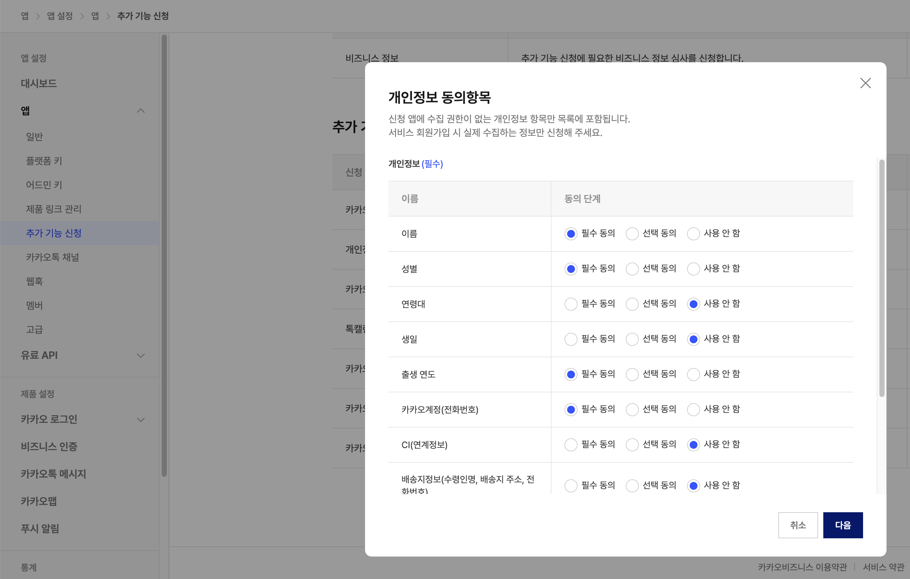
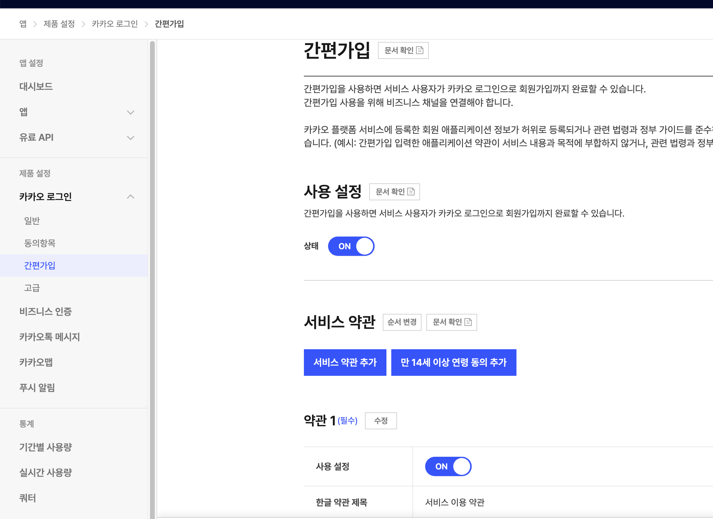
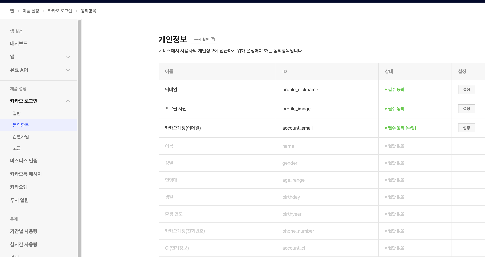

# 카카오싱크 개인정보 동의항목 설정 가이드

> 작성일: 2026-01-25
> 프로젝트: 읽씹당했나 (ssum-pro)

## 개요

카카오싱크를 통해 사용자의 개인정보(이름, 성별, 출생연도, 전화번호)를 수집하려면 **추가 기능 신청**을 통해 심사를 받아야 합니다.

## 전제 조건

1. **비즈니스 인증 완료** - 비즈니스 정보 심사 승인 필요
2. **서비스 약관 페이지** - 이용약관 및 개인정보처리방침 URL 필요
3. **비즈니스 채널 연결** - 간편가입 사용을 위해 필요

## 설정 단계

### 1단계: 비즈니스 정보 심사

**경로:** `앱 설정 > 앱 > 추가 기능 신청`

1. "비즈니스 정보" 항목에서 "신청" 클릭
2. 사업자 정보 입력
3. 심사 승인 대기 (보통 1-3 영업일)


### 2단계: 개인정보 동의항목 심사 신청

**경로:** `앱 설정 > 앱 > 추가 기능 신청 > 개인정보 동의항목`

1. "신청" 버튼 클릭
2. 필요한 개인정보 항목 선택:

| 항목 | ID | 동의 단계 | 용도 |
|------|-----|----------|------|
| 이름 | `name` | 필수 동의 | 사용자 식별, 리포트 표시 |
| 성별 | `gender` | 필수 동의 | AI 분석 맥락 제공 |
| 연령대 | `age_range` | 사용 안 함 | - |
| 생일 | `birthday` | 사용 안 함 | - |
| 출생 연도 | `birthyear` | 필수 동의 | AI 분석 맥락 제공 |
| 전화번호 | `phone_number` | 필수 동의 | 알림톡 발송 |
| CI(연계정보) | `account_ci` | 사용 안 함 | - |
| 배송지정보 | - | 사용 안 함 | - |

3. "다음" 클릭 후 심사 신청
4. 심사 완료 대기 (보통 1-5 영업일)



### 3단계: 간편가입 설정

**경로:** `제품 설정 > 카카오 로그인 > 간편가입`

1. **상태**: ON 설정
2. **서비스 약관 추가**:
   - "서비스 약관 추가" 버튼 클릭
   - 약관 제목: 서비스 이용 약관
   - 약관 URL: `https://ssum-pro.vercel.app/terms`

3. **개인정보처리방침 추가** (선택):
   - 약관 제목: 개인정보처리방침
   - 약관 URL: `https://ssum-pro.vercel.app/privacy`

4. 필요시 "만 14세 이상 연령 동의 추가"



### 4단계: 동의항목 설정 확인

**경로:** `제품 설정 > 카카오 로그인 > 동의항목`

심사 완료 후 각 항목의 상태가 변경됩니다:

| 항목 | 심사 전 상태 | 심사 후 상태 |
|------|------------|------------|
| 닉네임 (profile_nickname) | 필수 동의 | 필수 동의 |
| 프로필 사진 (profile_image) | 필수 동의 | 필수 동의 |
| 이메일 (account_email) | 필수 동의 [수집] | 필수 동의 [수집] |
| 이름 (name) | 권한 없음 | **필수 동의** |
| 성별 (gender) | 권한 없음 | **필수 동의** |
| 출생 연도 (birthyear) | 권한 없음 | **필수 동의** |
| 전화번호 (phone_number) | 권한 없음 | **필수 동의** |



## 코드 설정

### OAuth Scope 설정

```typescript
// src/app/api/auth/kakao/route.ts
kakaoAuthUrl.searchParams.set(
  'scope',
  'profile_nickname,profile_image,account_email,name,gender,birthyear,phone_number'
);
```

### 사용자 정보 추출

```typescript
// src/app/api/auth/callback/kakao/route.ts
interface KakaoUserResponse {
  id: number;
  kakao_account?: {
    profile?: {
      nickname?: string;
      profile_image_url?: string;
    };
    email?: string;
    name?: string;
    gender?: 'male' | 'female';
    birthyear?: string;
    phone_number?: string;  // 형식: +82 10-1234-5678
  };
}

// 전화번호 포맷 변환
const rawPhone = userData.kakao_account?.phone_number;
const phone = rawPhone
  ?.replace(/^\+82 /, '0')    // +82 → 0
  .replace(/-/g, '')          // 하이픈 제거
  .replace(/ /g, '');         // 공백 제거
// 결과: 01012345678
```

## 주의사항

1. **심사 전에는 권한 없음**: 개인정보 동의항목 심사가 완료되기 전까지 해당 필드들은 "권한 없음" 상태로 표시됩니다.

2. **필수 동의 vs 선택 동의**:
   - 필수 동의: 사용자가 반드시 동의해야 로그인 가능
   - 선택 동의: 사용자가 거부해도 로그인 가능 (null 값 반환)

3. **전화번호 포맷**: 카카오에서 제공하는 전화번호는 `+82 10-1234-5678` 형식이므로 한국 형식(`01012345678`)으로 변환 필요

4. **비즈니스 채널 필수**: 간편가입과 개인정보 수집을 위해서는 비즈니스 채널이 연결되어 있어야 합니다.

## 참고 링크

- [카카오싱크 개발 문서](https://developers.kakao.com/docs/latest/ko/kakaosync/common)
- [개인정보 동의항목](https://developers.kakao.com/docs/latest/ko/kakaologin/prerequisite#consent-items)
- [간편가입 설정](https://developers.kakao.com/docs/latest/ko/kakaologin/prerequisite#simple-signup)

## 스크린샷 파일 목록

프로젝트 `docs/screenshots/` 폴더에 원본 스크린샷 저장:

1. `kakao-sync-01-business-approved.png` - 비즈니스 정보 심사 승인 화면
2. `kakao-sync-02-personal-info-selection.png` - 개인정보 동의항목 선택 모달
3. `kakao-sync-03-simple-signup.png` - 간편가입 설정 화면
4. `kakao-sync-04-consent-items.png` - 동의항목 현재 상태
5. `kakao-sync-05-review-status.png` - 추가 기능 신청 심사 상태
